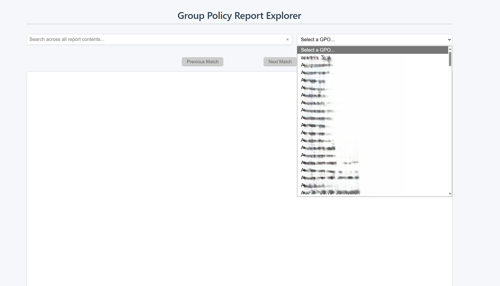
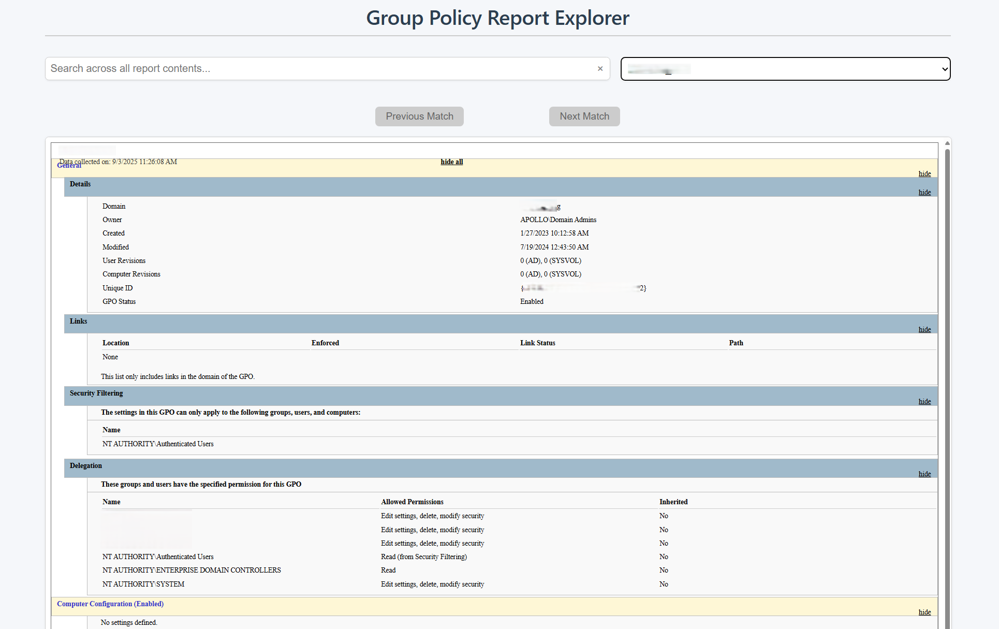

# Update-GPOExplorer
This project will help create a webpage that can display group policies and search through all GPOs. 

The GPO Explorer webpage contains a drop down of every GPO in the domain (as long as the account running the scheduled task or script has access to read the GPO). You can also choose to search through the group policies and iterate through each result. 

Example Drop Down:

Example Displaying GPO:

Things to Edit/Do to Make This Work For You
1. Edit the variables under "Variables to Edit" in the script.
2. Copy the IIS folder to your IIS directory for the website that you create.
3. Create a scheduled task to run the Update-GPOExplorer.ps1 powershell script. (Account must have Read access on GPOs)
4. Not required but recommended to lockdown the IIS webpage to only a certain group of users.
5. Optional - create a DNS entry for your website
